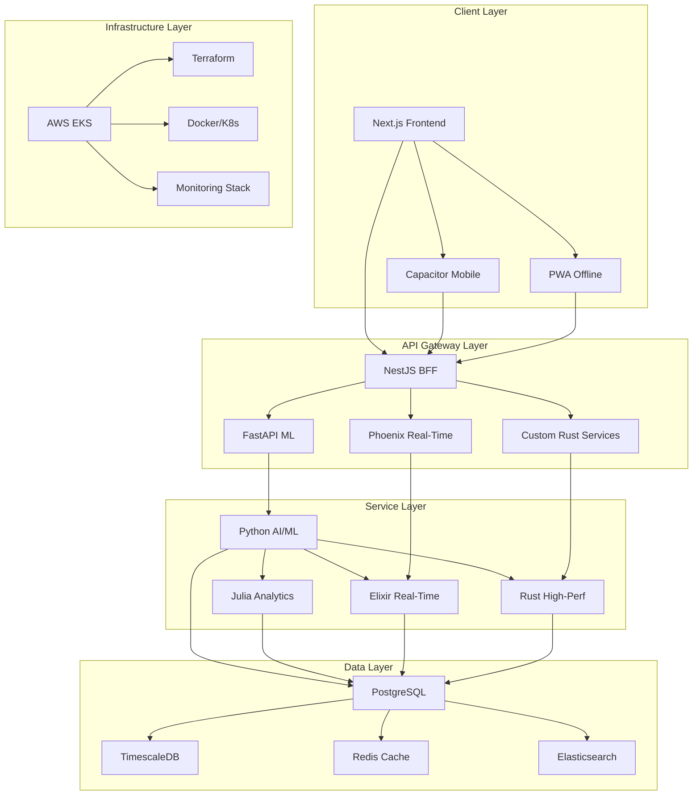

# Garlaws Platform - Polyglot Architecture Guidelines
## Fused Technology Stack & Implementation Framework

> **Document Version:** 1.0 | **Last Updated:** 2026-04-18
> **Status:** Active Development Guidelines
> **Scope:** Complete polyglot architecture fusion for Garlaws Ecosystem Platform

---

## Executive Summary

The Garlaws Platform implements a **polyglot architecture** that strategically combines **16+ programming languages and technologies** across specialized domains. This document establishes the official fused technology stack, combining the current Next.js/TypeScript implementation with the mandated roadmap technologies.

### Key Principles
- **Domain-Driven Language Selection**: Each language/technology serves specific functional domains
- **Performance Optimization**: High-performance languages (Rust, C++, Mojo) for computational bottlenecks
- **AI/ML Integration**: Python/Julia ecosystem for intelligent features
- **Real-Time Processing**: Elixir/Phoenix for concurrent, distributed systems
- **Legacy Compatibility**: Seamless integration between existing and new stacks

---

## Fused Technology Stack Matrix

### Core Architecture Layers

| Layer | Primary Language | Supporting Languages | Framework/Tools | Purpose |
|-------|------------------|---------------------|-----------------|---------|
| **Frontend** | TypeScript | JavaScript, HTML, CSS | Next.js 16 + React 19 | User interfaces, client-side logic |
| **Backend API** | TypeScript | Python, Elixir | NestJS, FastAPI, Phoenix | REST/GraphQL APIs, business logic |
| **Database** | SQL | TypeScript, Python | PostgreSQL, Supabase, TimescaleDB | Data persistence, analytics |
| **AI/ML** | Python | Julia, TypeScript | PyTorch, MLJ, TensorFlow | Predictive analytics, NLP, computer vision |
| **High Performance** | Rust | C++, Mojo, Python | Custom kernels, WebAssembly | Computational acceleration |
| **Real-Time** | Elixir | TypeScript, Python | Phoenix Framework, WebSockets | Live updates, messaging |
| **Mobile** | TypeScript | Kotlin, Swift | Capacitor, PWA, React Native | Cross-platform mobile apps |
| **Infrastructure** | HCL | YAML, Shell | Terraform, Docker, Kubernetes | Cloud provisioning, orchestration |

### Language Distribution by Domain

#### 🚀 **Performance Critical Components**
```
Languages: Rust, C++, Mojo
Frameworks: Custom kernels, WebAssembly, CUDA
Domains: AI inference, real-time processing, image processing, complex algorithms
Implementation: WASM modules, native extensions, GPU acceleration
```

#### 🤖 **AI/ML Intelligence Layer**
```
Languages: Python (Primary), Julia (Analytics), TypeScript (Integration)
Frameworks: PyTorch, MLJ, scikit-learn, TensorFlow, ONNX
Domains: Predictive maintenance, computer vision, NLP, anomaly detection
Implementation: Microservices, containerized models, REST APIs
```

#### ⚡ **Real-Time Systems**
```
Languages: Elixir (Primary), TypeScript (Frontend), Python (Data processing)
Frameworks: Phoenix Framework, WebSockets, gRPC, RabbitMQ
Domains: Live chat, notifications, real-time tracking, event streaming
Implementation: OTP processes, distributed systems, pub/sub messaging
```

#### 🏗️ **Enterprise Backend**
```
Languages: TypeScript (Primary), Python (Data pipelines), Go (Infrastructure)
Frameworks: NestJS, FastAPI, Nx Monorepo, Express.js
Domains: Business logic, API services, authentication, orchestration
Implementation: Microservices, BFF pattern, API gateways
```

#### 📱 **Mobile & PWA**
```
Languages: TypeScript (Primary), Kotlin (Android), Swift (iOS)
Frameworks: Capacitor, React Native, PWA, Ionic
Domains: Mobile apps, offline functionality, native features
Implementation: Hybrid apps, progressive web apps, native plugins
```

---

## Implementation Architecture

### Polyglot Service Mesh



### Communication Patterns

#### **Inter-Service Communication**
- **REST/HTTP**: Primary API communication (NestJS ↔ Python ↔ Elixir)
- **gRPC**: High-performance internal services (Rust ↔ Go ↔ C++)
- **WebSockets**: Real-time data streaming (Phoenix ↔ Frontend)
- **Message Queues**: Async processing (RabbitMQ, Redis Streams)
- **Event Streaming**: Domain events (Apache Kafka, NATS)

#### **Data Flow Architecture**
```
Frontend (TypeScript) → BFF (NestJS) → Domain Services (Polyglot) → Database (SQL)
                                       ↓
Real-Time (Elixir) ← WebSockets ← Live Updates
                                       ↓
AI/ML (Python) ← REST/gRPC ← Model Inference
                                       ↓
High-Perf (Rust) ← WASM ← Computational Tasks
```

---

## Development Workflow Guidelines

### Language-Specific Standards

#### **TypeScript/Node.js (Primary Frontend/Backend)**
```typescript
// File: src/lib/scheduling-optimization-engine.ts
// Standards: Strict TypeScript, comprehensive interfaces, error handling
export interface OptimizedSchedule {
  bookingId: string;
  assignedTechnician: string;
  scheduledDate: Date;
  // ... comprehensive typing
}
```

#### **Python (AI/ML Services)**
```python
# File: services/ai/predictive-maintenance.py
# Standards: Type hints, docstrings, async/await, Pydantic models
from pydantic import BaseModel
from typing import List, Optional

class PredictionRequest(BaseModel):
    equipment_id: str
    sensor_data: List[float]
    time_window: int

async def predict_maintenance(request: PredictionRequest) -> dict:
    """Predict equipment maintenance needs using ML models"""
    # Implementation with proper error handling
```

#### **Rust (High-Performance Kernels)**
```rust
// File: kernels/src/image_processing.rs
// Standards: Zero-cost abstractions, comprehensive error handling, WASM compatible
use wasm_bindgen::prelude::*;

#[wasm_bindgen]
pub struct ImageProcessor {
    // High-performance image processing implementation
}

#[wasm_bindgen]
impl ImageProcessor {
    pub fn process_drone_image(&self, image_data: &[u8]) -> Result<Vec<f32>, JsValue> {
        // Optimized computer vision algorithms
    }
}
```

#### **Elixir (Real-Time Systems)**
```elixir
# File: lib/garlaws/real_time/notifications.ex
# Standards: OTP patterns, supervision trees, immutable data
defmodule Garlaws.RealTime.Notifications do
  use GenServer

  def start_link(opts) do
    GenServer.start_link(__MODULE__, opts, name: __MODULE__)
  end

  def broadcast_notification(notification) do
    GenServer.cast(__MODULE__, {:broadcast, notification})
  end
end
```

### Project Structure (Polyglot Nx Monorepo)

```
garlaws-platform/
├── apps/
│   ├── frontend/                 # Next.js (TypeScript)
│   ├── api/                      # NestJS (TypeScript)
│   ├── ai-services/              # Python/FastAPI
│   ├── real-time/                # Elixir/Phoenix
│   └── mobile/                   # Capacitor (TypeScript)
├── libs/
│   ├── shared/                   # Cross-platform utilities
│   ├── ai-models/                # Python ML models
│   ├── kernels/                  # Rust high-performance
│   └── contracts/                # Type definitions
├── tools/
│   ├── infra/                    # Terraform/Docker
│   └── scripts/                  # Build/deployment scripts
├── packages/
│   ├── ui-components/            # Angular components
│   ├── design-system/            # Tailwind config
│   └── eslint-config/            # Linting rules
└── docs/                         # Documentation
```

---

## Integration Patterns

### Service Communication Standards

#### **API Contract Standards**
- **OpenAPI 3.0** specifications for all REST APIs
- **Protocol Buffers** for gRPC services
- **GraphQL Schema** for flexible data fetching
- **WebSocket Protocols** for real-time communication

#### **Data Serialization**
- **JSON** for API responses and configuration
- **MessagePack** for high-performance internal communication
- **Protocol Buffers** for cross-language data exchange
- **Arrow/Parquet** for analytical data

### Cross-Language Testing Strategy

#### **Unit Testing by Language**
```
TypeScript: Jest + React Testing Library
Python: pytest + coverage
Rust: cargo test + criterion benchmarks
Elixir: ExUnit + mix test
```

#### **Integration Testing**
- **API Contract Testing**: Pact.io for consumer-driven contracts
- **End-to-End Testing**: Playwright for UI, Postman/Newman for APIs
- **Performance Testing**: k6 for load testing, JMeter for complex scenarios

### Deployment & Orchestration

#### **Container Strategy**
```dockerfile
# Multi-stage builds for each language
FROM node:18-alpine AS frontend-build
# Next.js build process

FROM python:3.11-slim AS ai-service
# Python ML service with optimized base image

FROM rust:1.70-slim AS kernel-build
# Rust compilation for performance-critical code

FROM elixir:1.14-otp-25 AS real-time-service
# Elixir real-time service
```

#### **Kubernetes Orchestration**
```yaml
# Polyglot service deployment
apiVersion: apps/v1
kind: Deployment
metadata:
  name: garlaws-platform
spec:
  template:
    spec:
      containers:
      - name: frontend
        image: garlaws/frontend:latest
      - name: api
        image: garlaws/api:latest
      - name: ai-service
        image: garlaws/ai-service:latest
      - name: real-time
        image: garlaws/real-time:latest
```

---

## Performance Optimization Guidelines

### Language Selection Criteria

| Use Case | Primary Language | Rationale |
|----------|------------------|-----------|
| **Web Frontend** | TypeScript | Rich ecosystem, developer experience |
| **API Services** | TypeScript | Consistency, type safety, Node.js ecosystem |
| **AI/ML Inference** | Python | PyTorch, TensorFlow, rich ML libraries |
| **Data Analytics** | Julia | High-performance numerical computing |
| **Real-Time Processing** | Elixir | Concurrency, fault tolerance, OTP |
| **High-Performance Computing** | Rust | Memory safety, zero-cost abstractions |
| **System Programming** | C++/Mojo | Maximum performance, GPU acceleration |
| **Mobile Development** | TypeScript | Cross-platform with Capacitor |

### Performance Benchmarks

#### **Target Performance Metrics**
- **API Response Time**: <100ms (p95)
- **AI Inference Latency**: <50ms (p95)
- **Real-Time Message Delivery**: <10ms
- **Image Processing**: <500ms for 4K images
- **Database Query**: <50ms (p95)

#### **Optimization Techniques**
- **Caching Strategy**: Redis for session data, CDN for static assets
- **Load Balancing**: AWS ALB with auto-scaling groups
- **Database Optimization**: Connection pooling, query optimization, indexing
- **CDN Integration**: CloudFront for global content delivery

---

## Security Architecture

### Polyglot Security Model

#### **Authentication & Authorization**
- **JWT Tokens**: Cross-service authentication
- **OAuth 2.0 / OIDC**: Third-party integrations
- **Role-Based Access Control**: Hierarchical permissions
- **Zero-Trust Architecture**: Service mesh security

#### **Data Protection**
- **Encryption at Rest**: AES-256 for database, S3
- **Encryption in Transit**: TLS 1.3 for all communications
- **Data Classification**: PII, PHI, financial data handling
- **Compliance**: POPIA, GDPR, industry standards

### Language-Specific Security

| Language | Security Focus | Tools |
|----------|----------------|-------|
| **TypeScript** | Input validation, XSS prevention | Helmet, Joi, OWASP guidelines |
| **Python** | Secure coding, dependency scanning | Bandit, Safety, pip-audit |
| **Rust** | Memory safety, thread safety | Built-in guarantees |
| **Elixir** | Secure concurrency, DoS protection | OTP security patterns |

---

## Migration & Adoption Strategy

### Phase Implementation Plan

#### **Phase 1-3: Foundation (Months 1-9)**
- Maintain current Next.js/TypeScript stack
- Introduce Python for AI/ML proof-of-concepts
- Establish Nx monorepo structure
- Implement basic NestJS services

#### **Phase 4: Polyglot Introduction (Months 10-12)**
- Deploy Python AI/ML services in production
- Introduce Rust kernels for performance-critical functions
- Launch Elixir real-time services
- Implement cross-service communication patterns

#### **Phase 5-6: Full Polyglot (Year 2+)**
- Migrate legacy components to appropriate languages
- Optimize performance with language-specific implementations
- Implement advanced features (blockchain, edge computing)
- Achieve full compliance and enterprise features

### Migration Guidelines

#### **Service Migration Checklist**
- [ ] Performance benchmarking before/after
- [ ] Comprehensive test coverage
- [ ] Gradual rollout with feature flags
- [ ] Monitoring and rollback procedures
- [ ] Documentation updates
- [ ] Team training and knowledge transfer

#### **Integration Testing Requirements**
- [ ] Cross-service API contract testing
- [ ] End-to-end workflow validation
- [ ] Performance regression testing
- [ ] Security vulnerability scanning
- [ ] Compliance audit verification

---

## Development Team Structure

### Polyglot Development Teams

#### **Frontend Team (TypeScript/React)**
- **Responsibilities**: UI/UX development, PWA implementation
- **Tools**: Next.js, React, Tailwind CSS, Storybook
- **Skills**: Modern JavaScript, responsive design, accessibility

#### **Backend Team (TypeScript/Python/Elixir)**
- **Responsibilities**: API development, business logic, real-time features
- **Tools**: NestJS, FastAPI, Phoenix, PostgreSQL
- **Skills**: API design, database optimization, concurrent programming

#### **AI/ML Team (Python/Julia)**
- **Responsibilities**: ML model development, data pipelines, analytics
- **Tools**: PyTorch, MLJ, Jupyter, MLflow
- **Skills**: Machine learning, statistics, data engineering

#### **Performance Team (Rust/C++/Mojo)**
- **Responsibilities**: High-performance kernels, system optimization
- **Tools**: Rust, CUDA, WebAssembly, benchmarking tools
- **Skills**: Systems programming, parallel computing, optimization

#### **DevOps Team (Multi-language)**
- **Responsibilities**: Infrastructure, deployment, monitoring
- **Tools**: Terraform, Docker, Kubernetes, monitoring stack
- **Skills**: Cloud architecture, container orchestration, IaC

### Knowledge Sharing Requirements

#### **Cross-Training Program**
- **Language Basics**: All team members learn fundamentals of each stack
- **Code Reviews**: Mandatory cross-team reviews for polyglot interfaces
- **Documentation**: Comprehensive API documentation and integration guides
- **Pair Programming**: Regular sessions between different language teams

---

## Quality Assurance & Compliance

### Code Quality Standards

#### **Universal Standards**
- **Testing Coverage**: Minimum 80% for all services
- **Documentation**: OpenAPI specs, README files, code comments
- **Security Scanning**: Automated vulnerability detection
- **Performance Monitoring**: Response time and resource usage tracking

#### **Language-Specific Standards**
```
TypeScript: ESLint (strict), Prettier, TypeScript strict mode
Python: Black, isort, mypy, flake8
Rust: Clippy, rustfmt, cargo audit
Elixir: Credo, dialyxir, mix format
```

### Compliance Requirements

#### **Regulatory Compliance**
- **POPIA**: Data privacy and protection
- **B-BBEE Level 1**: Broad-based black economic empowerment
- **SARS VAT**: 15% VAT compliance and reporting
- **Industry Standards**: NHBRC, CIDB, SABS/SANS compliance

#### **Technical Compliance**
- **WCAG 2.1 AA**: Web accessibility standards
- **OWASP Top 10**: Security vulnerability prevention
- **GDPR**: European data protection compliance
- **ISO Standards**: Quality management and information security

---

## Monitoring & Observability

### Polyglot Monitoring Stack

#### **Application Monitoring**
```
Frontend: Sentry, LogRocket, Google Analytics 4
Backend: Winston logging, APM tools (DataDog, New Relic)
AI/ML: MLflow tracking, model performance monitoring
Real-Time: Phoenix telemetry, WebSocket monitoring
Infrastructure: Prometheus, Grafana, ELK stack
```

#### **Performance Monitoring**
- **Response Times**: API latency, page load times, AI inference times
- **Resource Usage**: CPU, memory, disk I/O, network bandwidth
- **Error Rates**: Application errors, failed requests, timeout rates
- **User Experience**: Core Web Vitals, conversion rates, user satisfaction

### Alerting & Incident Response

#### **Alert Categories**
- **Critical**: Service downtime, data loss, security breaches
- **High**: Performance degradation, high error rates
- **Medium**: Resource exhaustion, configuration issues
- **Low**: Warning conditions, maintenance notifications

#### **Response Procedures**
- **Automated**: Auto-scaling, circuit breakers, graceful degradation
- **Manual**: Incident response teams, communication protocols
- **Post-Mortem**: Root cause analysis, improvement implementation

---

## Future Evolution

### Technology Roadmap

#### **Year 2-3: Advanced Features**
- **Blockchain Integration**: Smart contracts for property tokenization
- **Edge Computing**: IoT mesh networks, local AI processing
- **Quantum Computing**: Optimization algorithms, complex simulations
- **AR/VR Integration**: WebXR, spatial computing

#### **Year 3-5: Enterprise Scale**
- **Multi-Cloud**: Hybrid cloud deployments, disaster recovery
- **Global Expansion**: Multi-region deployment, localization
- **Advanced AI**: AGI integration, autonomous systems
- **Sustainable Tech**: Green computing, carbon-neutral operations

### Continuous Improvement

#### **Technology Evaluation**
- **Annual Reviews**: Stack assessment, performance benchmarking
- **Innovation Pipeline**: Emerging technology evaluation
- **Team Feedback**: Developer experience, tooling improvements
- **Industry Trends**: Competitive analysis, market positioning

---

## Conclusion

This polyglot architecture guidelines document establishes the foundation for Garlaws Platform's multi-language, high-performance ecosystem. By strategically combining 16+ programming languages and technologies across specialized domains, the platform achieves optimal performance, scalability, and developer productivity.

**Key Success Factors:**
- Domain-driven language selection
- Comprehensive integration patterns
- Rigorous testing and quality assurance
- Continuous monitoring and optimization
- Cross-team collaboration and knowledge sharing

This document serves as the authoritative guide for all development activities and will be updated as the platform evolves.

---

**Document Control:**
- **Version:** 1.0
- **Effective Date:** 2026-04-18
- **Review Cycle:** Quarterly
- **Approver:** Garlaws Technical Leadership
- **Distribution:** All development teams, stakeholders</content>
<parameter name="filePath">.kilocode/rules/polyglot-architecture-guidelines.md